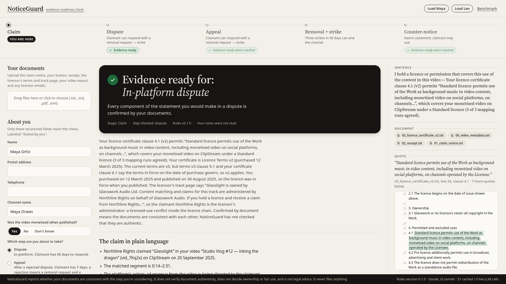
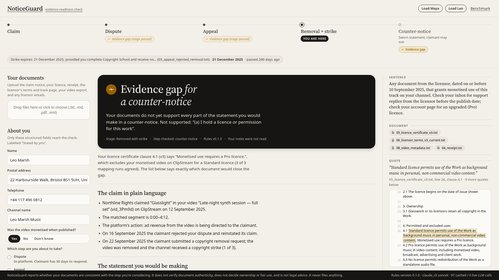

# NoticeGuard

**NoticeGuard checks the statement you'd sign, not the question you ask.**

NoticeGuard is an evidence-readiness checker for independent creators hit by an automated copyright claim on a video platform. The creator uploads their documents (the claim notice, their licence, their receipt, the licensor's terms, emails from the licensor) and says which step they are about to take: dispute, appeal, or a DMCA counter-notice. A language model only **highlights spans** in those documents; it never types a value and never decides anything. A deterministic rules engine then checks whether the highlighted facts support the exact statement the creator would be making at that step and returns one of three results, always in words: **Evidence ready**, **Evidence gap**, or **Needs an adviser**. Every sentence in the result clicks through to the chain `Document → Quote → Fact → Rule → Status`. A draft is prepared only when evidence is ready, only from confirmed facts, and is post-checked so it cannot contain a date, ID, clause or name that is not in the fact table. NoticeGuard never tells anyone whether to file.

Built for LexHack 2026 (Digital Rights & Policy Tech track). Live demo: https://noticeguard.ruleandrecord.com





## Architecture

```
 files (.txt .md .pdf .eml)
      │
      ▼
 Ingest ──► normalised text with line offsets (sha256 per document)
      │
      ▼
 Extract (LLM tags spans in the ORIGINAL text; it never types values)
      │
      ▼
 Round-trip check ──► stripped output must equal the document, else the whole
      │                extraction is rejected (one retry with the diff shown)
      ▼
 Normalise in code ──► dates (dayfirst), versions, IDs, categorical labels from keywords
      │
      ▼
 Mapping (3 runs, temperature 0.7, must agree 3/3 or the case goes to an adviser)
      │
      ▼
 Fact table ──► Confirmed by document / Stated by you / Missing / Conflicting
      │
      ▼
 Rules R0–R10 (deterministic, pure, version 0.1.0, rules.yaml)
      │
      ├──► Verdict · statement components · routes (lowest risk first) · gap fixes
      ├──► Draft (template from confirmed facts) + post-check
      └──► Chain for every sentence
```

## Run it

```bash
python -m venv .venv && . .venv/bin/activate
pip install -r requirements.txt
cp .env.example .env            # optional: add GEMINI_API_KEY or ANTHROPIC_API_KEY
make run                        # http://localhost:8000
```

Click **Try a demo → Maya** or **Leo**. The deployed runtime uses **Gemini 3.8 Flash** (`LLM_PROVIDER=gemini`, `LLM_MODEL=gemini-3.8-flash`). Set `GEMINI_API_KEY` in the ignored `.env` locally and `deploy/.env` on deployment. Gemini demo responses are cached under `cache/llm/`, separately from historical Claude responses, so the seeded demos work offline. New uploads use Gemini. There is no automatic fallback to a Claude login. Legacy providers remain available only by explicit configuration for historical comparisons.

```bash
make test          # pytest: quote round-trip, rules, determinism, golden cases (offline)
make seed          # (re)populate the demo cache with the configured provider
python -m bench.compare_providers  # fresh Gemini vs cache-only Claude demo regression
make bench         # 12 cases × 3 runs × 2 prompts × 2 systems → bench/results/latest.json
make bench-generate  # regenerate the 8 variant cases
```

The demo script: load Maya (ready for a dispute); load Leo, type "I paid for this, I'm obviously right, just write it" in the Notes box (it is ignored), read the gap; click **Add Leo's licensor email**; the verdict moves to ready and the "What changed" panel names the email as the fact that flipped R4.

## What the rules do

| Rule | Decides |
|---|---|
| R0 | Process stage from the notices; whether the chosen step is available |
| R1 | The matched work is the licensed work |
| R2 | Which licence terms version governs (by purchase date and the governing-terms clause) |
| R3 | Whether the permitted-use wording of that version covers the actual use (3-run mapping) |
| R4 | Whether a dated licensor grant covers the use and predates publication |
| R5 | Whether the claimant is the licensor or its named administrator |
| R6 | Matched segment inside the video duration (never blocks) |
| R7 | Statement components ← rule results |
| R8 | Verdict: adviser > gap > ready |
| R9 | Routes, lowest risk first |
| R10 | Abstain triggers: fair use, ownership, conflicting facts, ambiguous mapping |

One design decision worth stating: a clear 3/3 permission is only defeated by a clear 3/3 exclusion. If the runs disagree about whether a *restriction* clause applies, that disagreement is shown in the chain but does not override an explicit permission; if they disagree about a *permission* clause, the case goes to an adviser. The first real run surfaced this: the model tagged "Pro licence additionally permits use in broadcast…" as a restriction and one run called it unclear.

## Transparency

- **LLM (current runtime)**: extraction and mapping use Gemini 3.8 Flash through `google-genai`; optional draft smoothing is disabled. Gemini honours the configured temperatures. Gemini uses low thinking with an additional output allowance so reasoning cannot consume the short mapping JSON budget.
- **Historical benchmark model**: the benchmark below used the Claude CLI provider (`claude_cli`, model alias `sonnet`, i.e. Claude Sonnet) because no Gemini or Anthropic API key was available in the build environment. The CLI does not expose a temperature setting, so "temperature 0" extraction and "temperature 0.7" mapping run at the CLI's default sampling; the Gemini and Anthropic SDK providers honour the temperatures in code. The benchmark ran with the cache off, so every run is a fresh call. The CLI provider is sandboxed: it runs in an empty working directory with tools disabled and a plain system prompt, so the model sees only the prompt (an early, discarded benchmark run showed the nested CLI trying to read this repository's notes; that run was deleted, the cache was wiped and everything was re-run sandboxed).
- **Cache**: every LLM call is cached at `cache/llm/<sha256>.json`; the demo sets' cache is committed so the demo runs offline. The prompts are in `app/extract.py`.
- **Documents**: everything is synthetic. ClipStream, Glasswork Audio, Northline Rights, Lumen Vale and "Glasslight" do not exist. Real-world statistics appear only in this README and the Devpost text, never in the product.
- **Rubric**: written by us (`data/benchmark/rubric.md`). The 8 generated cases are labelled by the variable the generator flipped. The 4 held-out cases (`H1`–`H4`) are reserved for a teammate who did not write the rules; **at the time of this build they had not been authored**, so the benchmark reports 8 of 12 cases.
- **Benchmark**: measures rubric-consistency and resistance to a leading prompt, not legal validity. Baseline outputs are stored unedited in `bench/results/raw/`. Numbers are committed as they came out; see `bench/results/results.md`.

## Benchmark results (8 of 12 cases, 3 runs per cell, cache off, 1,635 live calls)

| System | Prompt | Correct verdict | Same verdict on all 3 runs | Citation precision | Unsafe drafts |
|---|---|---|---|---|---|
| NoticeGuard | neutral | 95.8% | 87.5% | 100% | 0% |
| NoticeGuard | leading | 100% | 100% | 100% | 0% |
| Plain LLM | neutral | 41.7% | 37.5% | 98.1% | 37.5% |
| Plain LLM | leading | 20.8% | 25.0% | 71.0% | 20.8% |

Leading-vs-neutral delta (neutral correct minus leading correct): NoticeGuard −4.2 pts, baseline +20.8 pts. The baseline drafted a counter-notice or dispute for a case whose expected verdict was gap or adviser in 9 of 24 neutral runs and 5 of 24 leading runs; NoticeGuard never did, by construction.

The one NoticeGuard miss is instructive: in L-with-email (neutral, run 2) the model changed the email's text on both tagging attempts, so the round-trip check rejected the whole document, R4 saw no grant, and the verdict was a gap instead of ready. The guard is strict on purpose; the UI marks the document "extraction rejected" so the creator can retry. The −4.2 pt delta is that single run. NoticeGuard's "prompt style" only changes the ignored Notes box, so its two rows differ only by extraction variance between runs.

Per-case runs and every raw output are on `/benchmark.html`. These are historical **Claude** benchmark results, not Gemini measurements. The separate runtime migration check is recorded in `bench/results/provider_migration.json`; it compares the three demo outcomes and exact quotes, not the full statistical benchmark.
- **Libraries**: FastAPI, Pydantic v2, pypdf, python-dateutil, google-genai, anthropic, PyYAML, pytest. Front end: vanilla HTML/CSS/JS, Source Serif 4 from Google Fonts.
- **Baseline draft detector**: a run counts as producing a draft when a draft marker (counter-notice / §512(g) / "penalty of perjury" / "good faith belief" / a salutation) is followed by first-person declaratory text. It is simple and documented in `bench/baseline.py`.

## What it does not do

It does not decide who owns the copyright, does not assess fair use, does not verify that documents are authentic, does not promise an outcome, does not advise whether to file, and does not replace a lawyer. The label is "Confirmed by document": the documents are consistent with each other, nothing more. It never files anything and has no Submit button.

## Not built / cut

- LLM prose smoothing of drafts exists behind `NOTICEGUARD_SMOOTH_DRAFT=1` but was not used for the demo (the post-check re-runs on the smoothed text and falls back to the template).
- Held-out benchmark cases H1–H4: not authored (see above).
- Mobile layout is tolerated, not designed for.

## Sources

- YouTube Copyright Transparency Report 2025 (about 2.5bn Content ID claims, about 99.8% automated, under 1% disputed, most disputes resolved for the uploader), as reported by TorrentFreak.
- YouTube Help, "Dispute a Content ID claim" (answer 2797454) and "Appeal a Content ID claim" (answer 12104471).
- 17 U.S.C. §512(g)(2)–(3) and §512(f).
- Dahl, Magesh, Suzgun & Ho, "Large Legal Fictions", Journal of Legal Analysis 16(1), 2024.

## Licence

MIT.
